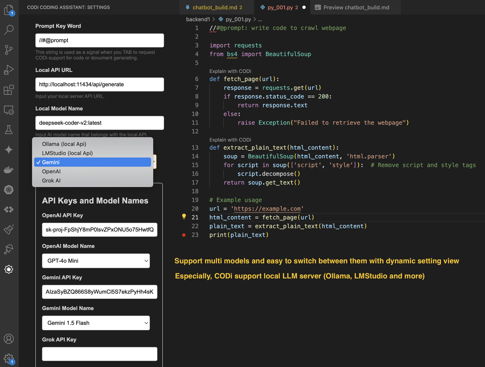
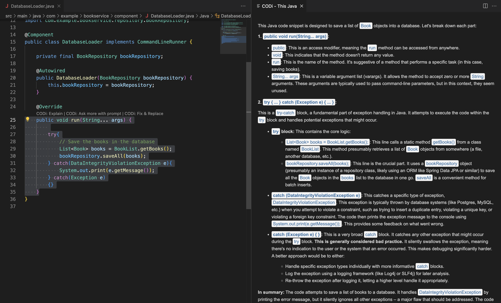
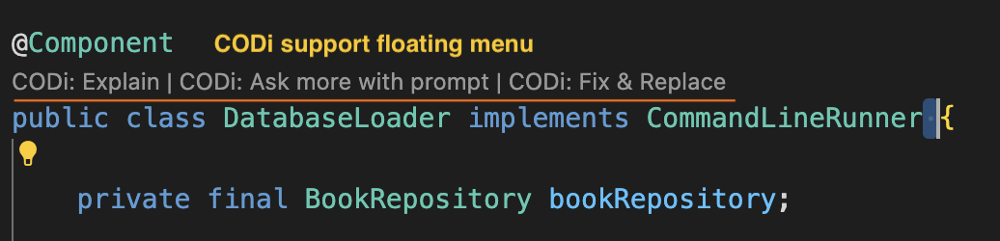
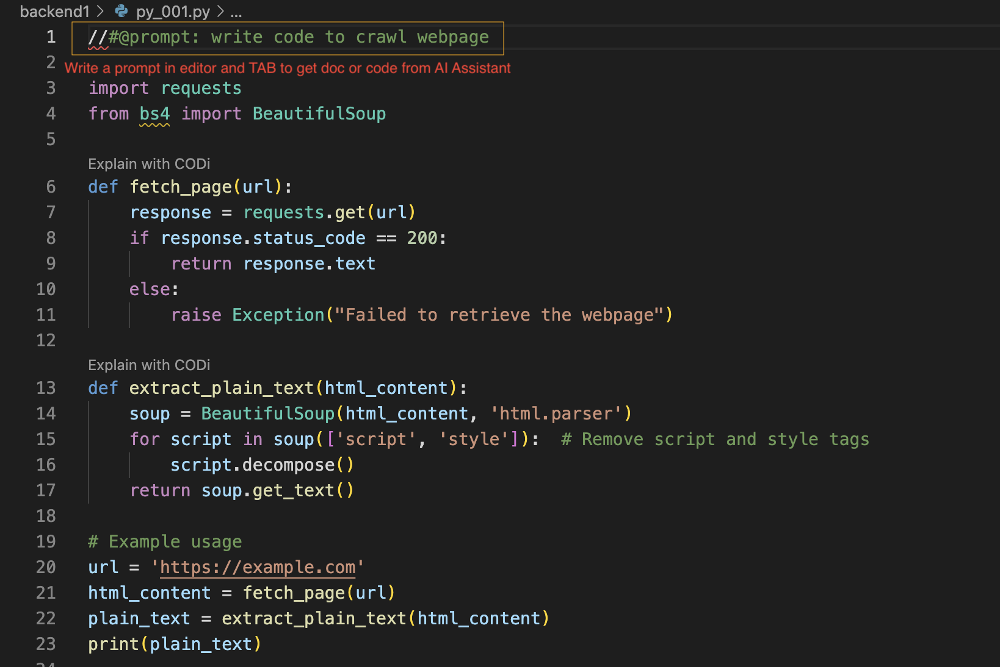

# CODi - Coding Assistant

This extension serves as a powerful coding assistant, enabling developers to research and write code more efficiently and accurately. It supports various common LLM cloud providers such as OpenAI, Gemini, Grok, and Claude, as well as local LLMs like Ollama and LM Studio, helping developers receive support faster while significantly reducing costs.

## Features

- **Multi-LLM Provider Support**: Seamlessly switch between multiple LLM providers (OpenAI, Gemini, Grok, Claude).
- **Local LLM Integration**: Utilize local LLMs like Ollama and LM Studio for quicker responses and cost savings.
- **Code Optimization**: Get recommendations for optimizing your code as you write.
- **Research Assistance**: Effortlessly research coding queries and get instant responses.
- **Privacy Focused**: Trust that this extension does not collect or send any private data over the internet.
- **Floating menu**: A floating menu above the code, line, or block can assist you in making code suggestions or asking additional questions effortlessly. Additionally, you can use this menu to input your own prompts for further assistance or to fix coding issues quickly.

## Some images for reference

``Dynamic setting UI``

``Code explanation``

``Floating menu``

``Generate code with inline prompt``

## Requirements

- Visual Studio Code (version 1.97.0 or higher)
- Internet connection for cloud provider features
- To have a Gemini, OpenAI, or Grok API key and choose an appropriate model to use involves several steps and considerations
- Local LLM setup (if using local integrations)

### Installation

To set up local LLMs, you can follow these guides:

- **Ollama**: Install Ollama by following the instructions on their [official website](https://ollama.com/docs/getting-started). After installation, you can pull models using commands like `ollama pull qwen2.5-coder:7b`.
  
- **LM Studio**: Download LM Studio from their [official site](https://lmstudio.ai) and follow the setup instructions provided there.

## Extension Settings

This extension contributes the following settings:
`Check the detail at the end of this file.`

## Important notes

- The extension doesn't collect and/or transfer any data from the client over the internet.
- When using local LLM services, users might experience performance (response speed) and accuracy issues that depend on the specific model selected to run in Ollama or LM Studio.
- In most cases, using cloud LLM providers like Gemini, OpenAI, or Grok will result in faster response times compared to local API services.
- The response time of local LLM services is significantly influenced by the local computer's hardware (CPU, GPU support).

## Release Notes

### 0.0.1

- Dynamic settings help you easily switch between LLM models and providers while coding.
- Keyword explanation pops up on mouse hover.
- Review and fix selected code (line, block, or the entire file).
- Floating action menu appears at the top of the code block or selected lines of code.

### 0.0.2 (current)

> In this version includes:

- **Update description**: Edit and update any incorrect links and add a 'no data collection' statement to the description.

## Additional Resources

For more information on the cloud providers supported by this extension, you can visit the following links:

- **OpenAI**: [OpenAI API Documentation](https://platform.openai.com/docs/introduction)
- **Gemini**: [Gemini Documentation](https://ai.google.dev/gemini-api/docs)
- **Grok**: [Grok Documentation](https://docs.x.ai/docs/overview)
- **Claude**: [Claude Documentation](https://anthropic.com/claude)

These resources will help you easily find the information you need to get started with each provider.

>## Configuration Settings

### Prompt Keyword

- **Description**: Set the keyword that signals when you want CODi to assist you. You can customize it to your preference.

### Local API URL

- **Description**: Enter the URL for your local server API. This is necessary for CODi to connect to your local service.

### Service Provider

- **Description**: Choose your server provider. Options include Ollama, LMStudio, or remote services like OpenAI, Gemini, and Grok AI.

### Local Model Name

- **Description**: Specify the name of the AI model you want to use with your local API.

### Show Response Page

- **Description**: Decide whether to display the AI response next to your current page or as a single page.

### OpenAI API Key

- **Description**: Input your OpenAI API key to access OpenAI services.

### OpenAI Model Name

- **Description**: Select the model you want to use with OpenAI, such as GPT-4 Turbo or others.

### Gemini API Key

- **Description**: Enter your Gemini API key for access to Gemini services.

### Gemini Model Name

- **Description**: Choose the Gemini model you want to use from the available options.

### Grok API Key

- **Description**: Provide your Grok API key to utilize Grok's capabilities.

### Grok Model Name

- **Description**: Select the Grok model you want to use, with options for different token capacities.

## Getting Started

To configure CODi, simply adjust these settings in your preferences to tailor the assistant to your workflow!
